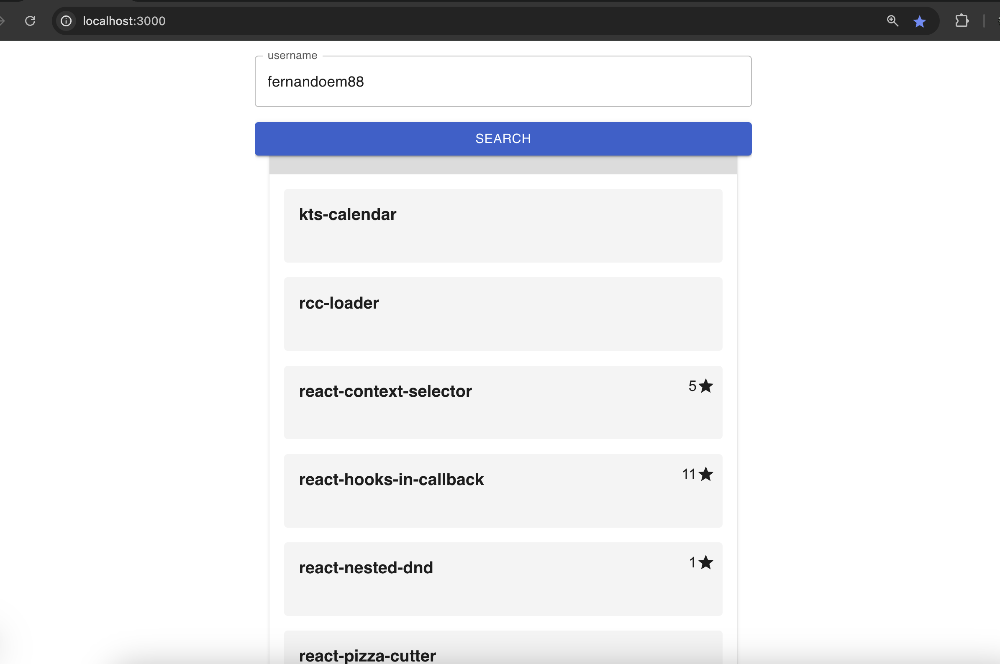

# GitHub Users Search

This is a GitHub user search project built with [Next.js](https://nextjs.org).

## Getting Started

Follow these steps to run the project locally:

1. **Install Dependencies:**

   ```bash
   npm install
   ```

2. **Add Your Github Token Key**

- go to [github.com](https://github.com) and create/copy a token key.
- come back to the project and create a `.env.local` file at the root folder
- write down your github token key in the _.en.local_ file like follows:
- NEXT_PUBLIC_GITHUB_KEY=your-token-key-goes-here

3. **Start the Development Server:**

   ```bash
   npm run dev
   ```

4. **Open the Application:**  
   Navigate to [http://localhost:3000](http://localhost:3000) in your browser to view the app.



---

## Key Libraries

This project uses the following libraries:

- **React-Query** for the global state management.
- **Material UI:** For CSS-in-JS styling, enabling scoped and dynamic styles.
- **react-intersection-observer:** A utility built on top of the Intersection Observer API for handling view-related logic.
- **zod:** A library for data validation and schema definition, ensuring robust data handling.

---

## Project Structure

The key folders are located in the main [**src**](./src) directory:

- **[app](./src/app/page.ts):** Contains the main entry point for routing.
- **[components](./src/components/):**  
  These are reusable, presentational components. They don't directly manage application state, instead receiving data as props and potentially managing their own local state.
- **[containers](./src/containers/):**  
  Components that directly consume and manage application state. The main entry point is the [RootContainer](./src/containers/RootContainer/index.tsx).
- **[contexts](./src/contexts/):**  
  This folder contains global providers like `AppQueryProvider`, which handles global state management.
- **[libs](./src/libs/):**  
  Utilities such as API service functions and custom hooks.

---

## Features and Performance

- **Infinite Scrolling:**  
  When you scroll to the bottom of the list, the application triggers a "fetch next users" action to load additional users dynamically.
- **On-Demand Data Fetching:**  
  User repositories are only fetched when needed, specifically when the corresponding accordion is expanded, to minimize unnecessary API calls.

- **Optimized DOM Rendering:**  
  Each user item contains hundreds of potential DOM elements. Since the search results can include thousands of items, rendering them all would result in performance bottlenecks. To mitigate this:
  - Each user item renders as a single placeholder element when out of view.
  - This approach reduces the DOM footprint significantly—e.g., for 2,000 items, only thousands of elements are rendered instead of millions.

---

## Future Improvements

To further optimize performance by reducing the number of DOM elements:

- Implement a **windowing technique** that uses only two placeholders (one at the top and one at the bottom) to dynamically render visible items.
- This would require slicing the list array and calculating the height of the top and bottom placeholders dynamically.  
  If needed, we can discuss this approach further.

---

Let me know if you'd like any other updates or clarifications!
